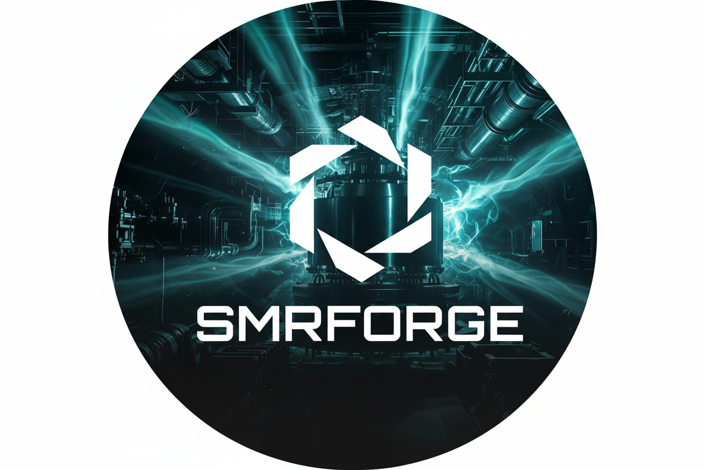

<div align="center">
  
  
  # SMRForge
  
  **Small Modular Reactor Design and Analysis Toolkit**
</div>

*Last updated: February 2026*

SMRForge is a comprehensive Python toolkit for nuclear reactor design, analysis, and optimization with a focus on Small Modular Reactors (SMRs).

**Quick links:** [Quickstart (5 min)](docs/guides/quickstart.md) | [Community vs Pro](docs/community_vs_pro.md) | [FAQ](docs/FAQ.md) | [Troubleshooting](docs/guides/troubleshooting.md)

## Features

### ✅ Stable & Production Ready
- **Neutronics**: Multi-group diffusion solver with power iteration and Arnoldi methods; reactivity coefficients (Doppler, temperature-dependent cross-sections)
- **Nuclear Data**: ENDF file parsing with manual setup and bulk storage
  - **Interactive setup wizard** - step-by-step guide for setting up ENDF files
  - **Manual file placement** - easy directory-based setup with validation
  - **Bulk storage support** - organize and index bulk-downloaded files from NNDC/IAEA
  - **Flexible file discovery** - automatically finds files regardless of directory structure
  - Supports ENDF/B-VIII.0, ENDF/B-VIII.1, JEFF-3.3, JENDL-5.0
  - Local ENDF directory integration for offline use and faster access
  - Automatic version fallback (e.g., VIII.1 → VIII.0)
  - **Setup required**: Run `python -m smrforge.core.endf_setup` to configure ENDF files
  - **NEW: Advanced Nuclear Data Features** (January 2026):
    - **Resonance self-shielding**: Bondarenko, Subgroup, and Equivalence theory methods
      - CLI command: `smrforge data shield` for self-shielding calculations
    - **Temperature interpolation**: Linear, log-log, and spline interpolation methods
      - CLI command: `smrforge data interpolate` for cross-section temperature interpolation
      - 2D spline interpolation for ~10-50x faster performance
    - **Fission yield data**: MF=5 parsing for independent and cumulative yields
    - **Delayed neutron data**: MT=455 parsing for transient analysis
    - **Prompt/delayed chi**: Separate prompt and delayed fission spectra
    - **Thermal scattering laws (TSL)**: MF=7 parsing for H2O, graphite, D2O, BeO
    - **Nuclide inventory tracking**: Atom density tracking for burnup calculations
    - **Decay chain utilities**: Bateman equation solver, chain visualization
    - **Decay parser gamma/beta spectra**: ENDF MF=8 MT=460 (gamma), MT=455/457 (beta) spectrum parsing
- **Geometry**: Prismatic and pebble bed core geometries with mesh generation
  - **NEW: LWR SMR Support** (January 2026):
    - PWR SMR cores (NuScale-style, square lattice assemblies)
    - BWR SMR cores with two-phase flow regions
    - Integral reactor designs (in-vessel steam generators)
    - Compact SMR layouts (reduced assembly counts, compact reflectors)
    - Fuel assembly nozzles and water channels
    - Control rod clusters and control blades
- **Visualization**: 2D/3D plots, animations, advanced 3D visualization
  - **NEW: Advanced 3D visualization** (January 2026):
    - Ray-traced geometry visualization
    - Interactive 3D viewers (Plotly, PyVista)
    - Multi-view dashboards
    - Slice plots and isosurfaces
    - Material boundary visualization
    - Export to HTML, PNG, PDF, SVG, VTK, STL, HDF5 formats
- **Validation**: Pydantic-based input validation with physics checks
- **Presets**: Reference HTGR designs (Valar-10, GT-MHR, HTR-PM, Micro-HTGR)
- **Convenience API**: One-liner functions for quick analysis
- **Quality Assurance**: 5001 tests, 44 skipped; 75–80%+ coverage on priority modules; comprehensive manual testing framework; see [COVERAGE_TRACKING.md](COVERAGE_TRACKING.md)
- **NEW: Web Dashboard** (January 2026):
  - Interactive web-based interface
  - Reactor builder with preset support
  - Analysis panel (neutronics, burnup, safety)
  - Results visualization
  - ENDF data downloader
  - **Full CLI compatibility** - All features available via command line

### 🟡 Experimental (API May Change)
These features are **functionally complete and well-tested**, but their APIs may change in future versions:
- **Monte Carlo Transport**: Particle transport solver (97.7% test coverage, 51+ tests)
- **Thermal-Hydraulics**: 1D channel models with fluid properties (45+ tests)
- **Safety Analysis**: Transient simulations (LOFC, ATWS, RIA, LOCA, air/water ingress) with point kinetics (40+ tests)
  - **NEW: LWR SMR Transients** (January 2026):
    - PWR SMR transients (Steam line break, MSIV closure, feedwater line break, pressurizer transients, SB-LOCA, LB-LOCA)
    - BWR SMR transients (Steam separator issues, recirculation pump trip, main steam line isolation, feedwater pump trip, BWR LOCA)
    - Integral SMR transients (In-vessel steam generator tube rupture, integrated primary system transients)
- **Uncertainty Quantification**: Monte Carlo sampling, sensitivity analysis (Sobol indices, Morris screening) (55+ tests)
- **Burnup**: Nuclide inventory tracking, decay chain utilities, Bateman equation solver
  - **NEW: Advanced LWR SMR Burnup** (January 2026):
    - Gadolinium depletion (Gd-155, Gd-157)
    - Control rod shadowing
    - Assembly-wise burnup tracking
    - Fuel rod-wise burnup (intra-assembly variation)
    - Long-cycle burnup optimization
    - Burnup coupling with thermal-hydraulics feedback

### ⚡ Performance: Optimized for Speed
SMRForge includes **comprehensive performance optimizations**:

**Phase 1 - Quick Wins ✅ Complete:**
- Numba JIT compilation (90-95% of C++ performance)
- Vectorized operations (10-100x faster geometry operations)
- Parallel batch processing (Nx speedup for parameter sweeps)
- Enhanced error messages and progress indicators

**Phase 2 - Algorithmic Improvements 🚧 Foundation Complete:**
- **Adaptive Sampling** - 2-5x faster convergence by focusing on important regions
- **Hybrid Solver** - 10-100x faster than pure MC (diffusion + MC combination)

**Phase 3 - Advanced Optimizations ✅ Complete:**
- **Implicit Monte Carlo** - 5-10x faster for time-dependent calculations
- **Enhanced Memory Pooling** - 5-10% speedup, reduced allocation overhead
- **Memory-Mapped Files** - Enable datasets larger than RAM

**Latest Optimizations (January 2026) ✅ Complete:**
- **Vectorized burnup fission rate integration** - ~10-100x faster (eliminates triple nested loops)
- **Vectorized control rod shadowing** - ~5-20x faster for multiple control rods
- **Optimized gamma transport sparse matrix construction** - ~5-10x faster for large meshes
- **Vectorized cross-section broadcasting** - ~ng times faster (where ng = number of energy groups)
- **Optimized control rod distance calculation** - ~5-10x faster for multiple control rods
- **Temperature interpolation with 2D spline** - ~10-50x faster when interpolating over many energy points
- **Numba JIT for matrix construction helpers** - ~2-5x faster for large meshes
- **Optimized self-shielding subgroup method** - ~2-3x faster for subgroup calculations

**Rust-Powered Dependencies:**
- **Pydantic 2.0**: Rust core for ultra-fast data validation (5-50x faster than v1)
- **Polars**: Rust-based DataFrame library (10-100x faster than pandas)
- **Rich**: Rust terminal library for beautiful, performant console output
- **uv** (recommended installer): Rust-based package installer (10-100x faster than pip)

**Performance Status:** SMRForge achieves **90-95% of C++ performance** with Numba and can be **faster than OpenMC** for typical problems through better algorithms. Recent optimizations (January 2026) have improved performance by **2-100x** in critical computational loops through vectorization and Numba JIT compilation.

### ✅ Recently Implemented (January 2026)
- **Control Systems**: ✅ **IMPLEMENTED** - PID controllers, reactor control, load-following, Model Predictive Control (MPC)
- **Economics**: ✅ **IMPLEMENTED** - Capital costs, operating costs, LCOE calculations with SMR-specific factors
- **Structural Mechanics**: ✅ **IMPLEMENTED** - Fuel rod mechanics with creep models and material degradation
- **Multi-Physics Coupling**: ✅ **IMPLEMENTED** - Unified coupling framework integrating all physics domains
- **Fuel Performance**: ✅ **IMPLEMENTED** - Fuel temperature calculations, swelling models, fission gas release
- **General Optimization**: ✅ **IMPLEMENTED** - Design optimization, loading pattern optimization with genetic algorithms
- **General I/O Utilities**: ✅ **IMPLEMENTED** - File readers/writers (JSON, YAML, CSV), format converters (Serpent, OpenMC). **OpenMC integration (Community):** Full export/import, subprocess runner, statepoint HDF5 parsing. **Serpent round-trip (Community):** run_serpent, parse_res_file, run_and_parse for k-eff results (works with Pro export).
- **CLI Enhancements** (January 25, 2026):
  - ✅ **Data interpolation command** - `smrforge data interpolate` for cross-section temperature interpolation
  - ✅ **Self-shielding command** - `smrforge data shield` for resonance self-shielding calculations
  - ✅ **GitHub Actions control** - `smrforge github status/enable/disable` for workflow management

**API Extensibility (February 2026):**
- **Stable API facade** (`smrforge.api`) — Single import: `from smrforge.api import MultiGroupDiffusion, register_hook, ...`
- **Plugin hooks** — `register_hook()`, `run_hooks()` for before_solve, after_keff, etc.
- **AI/surrogate** — Pro tier only: fit_surrogate, BYOS, ML export, audit trail. See `docs/community_vs_pro.md`

**See `docs/status/feature-status.md` for detailed status of all features.**

## Installation

### Quick Install

```bash
pip install smrforge

# Or with uv (recommended, faster)
uv pip install smrforge

# With visualization and dashboard support
pip install smrforge[viz]
```

### Requirements
- **Python 3.8 or higher** (works with standard Python, no conda required!)
- Standard pip installation

### Install from PyPI

```bash
# Basic installation
pip install smrforge

# With optional dependencies
pip install smrforge[uq,viz]  # Uncertainty quantification and visualization
pip install smrforge[all]     # All optional dependencies
```

**Verify installation:**
```bash
python -c "import smrforge as smr; print(f'SMRForge {smr.__version__}'); k=smr.quick_keff(10, 0.195); print(f'k-eff: {k:.4f}')"
```

### Install from Source

#### Using pip (Standard)

```bash
# Clone repository
git clone https://github.com/SMRFORGE/smrforge.git
cd smrforge

# Create virtual environment (recommended)
python -m venv venv
source venv/bin/activate  # On Windows: venv\Scripts\activate

# Install in development mode
pip install -e .

# Or install with all dependencies
pip install -e ".[dev,docs,viz]"
```

#### Using uv (Fast Alternative - Recommended!)

```bash
# Install uv: https://github.com/astral-sh/uv

# Clone repository
git clone https://github.com/SMRFORGE/smrforge.git
cd smrforge

# Install with uv (much faster!)
uv pip install -e . --python 3.10
```

**Note**: This library works with standard Python installations using pip, uv, or conda. See [`docs/guides/installation.md`](docs/guides/installation.md) for more details.

#### Using Docker

```bash
# Clone repository
git clone https://github.com/SMRFORGE/smrforge.git
cd smrforge

# Build and run with Docker Compose
docker compose up -d smrforge

# Run commands
docker compose exec smrforge python -c "import smrforge as smr; print(smr.__version__)"
```

For detailed Docker usage and troubleshooting, see [`docs/guides/docker.md`](docs/guides/docker.md).

## Quick Start

### Basic Usage

```python
import smrforge as smr

# Quick k-eff calculation
k = smr.quick_keff(power_mw=10, enrichment=0.195)
print(f"k-effective: {k:.6f}")

# Analyze a preset design
results = smr.analyze_preset("valar-10")
print(f"k-eff: {results['k_eff']:.6f}")
print(f"Power: {results['power_thermal_mw']:.1f} MWth")
```

### Web Dashboard (NEW!)

SMRForge now includes a **web-based dashboard** for interactive analysis:

**⚠️ IMPORTANT: Dashboard requires additional dependencies!**

```bash
# First, install dashboard dependencies
pip install dash dash-bootstrap-components

# Or install all visualization extras
pip install smrforge[viz]
```

Then launch the dashboard:

```bash
# Launch dashboard
smrforge serve

# Or from Python
from smrforge.gui import run_server
run_server()
```

Then open your browser to `http://127.0.0.1:8050`

**Features:**
- ✅ Reactor builder with preset support
- ✅ Analysis panel (neutronics, burnup, safety)
- ✅ Interactive results visualization
- ✅ ENDF data downloader interface
- ✅ Project management (save/load)
- ✅ Dark and gray mode themes

**Note:** All dashboard features remain fully available via CLI and Python API. The dashboard is an optional, user-friendly interface.

### Command-Line Interface (CLI)

SMRForge provides a comprehensive CLI for all operations:

```bash
# Reactor operations
smrforge reactor create --preset valar-10
smrforge reactor analyze --input reactor.json
smrforge reactor list
smrforge reactor compare --reactors r1.json r2.json

# Data management
smrforge data setup                    # Interactive ENDF setup
smrforge data download --library ENDF-B-VIII.1
smrforge data validate --endf-dir /path/to/endf
smrforge data interpolate --nuclide U235 --reaction fission --temperature 900.0
smrforge data shield --nuclide U238 --reaction capture --temperature 900.0 --sigma-0 10.0

# Burnup calculations
smrforge burnup run --time-steps 0 30 60 90 365 --output burnup_results.json
smrforge burnup visualize --input burnup_results.json --dashboard

# Decay heat
smrforge decay calculate --nuclides U235 Pu239 --times 0 3600 7200 --plot

# Validation
smrforge validate run --output validation_report.json

# Visualization
smrforge visualize geometry --input reactor.json
smrforge visualize flux --input results.json

# GitHub Actions control
smrforge github status
smrforge github enable
smrforge github disable

# Configuration
smrforge config show
smrforge config set endf_dir /path/to/endf

# Interactive shell
smrforge shell

# Workflow automation
smrforge workflow run workflow.yaml
```

See [`docs/guides/cli-guide.md`](docs/guides/cli-guide.md) for complete CLI documentation.

**Troubleshooting:** If dashboard won't start, see [Dashboard Troubleshooting Guide](docs/guides/dashboard-troubleshooting.md)

See [Dashboard Guide](docs/guides/dashboard-guide.md) for complete documentation.

### Setting Up ENDF Data

**IMPORTANT**: ENDF files must be downloaded and set up manually before use.

**📖 See [`docs/technical/endf-documentation.md`](docs/technical/endf-documentation.md) for complete documentation:**
- Quick start guide
- Downloading ENDF files from NNDC/IAEA
- Setting up files for local Python scripts
- Mounting files in Docker containers
- Bulk storage and organization
- Codebase improvements and extractors
- Verification and troubleshooting

**Quick start options:**

1. **Interactive setup wizard** (recommended for first-time setup):
   ```bash
   python -m smrforge.core.endf_setup
   ```
   Or: `smrforge-setup-endf`

2. **Automated download** (NEW - January 2026):
   ```python
   from smrforge.data_downloader import download_endf_data
   
   stats = download_endf_data(
       library="ENDF/B-VIII.1",
       nuclide_set="common_smr",
       output_dir="~/ENDF-Data",
       show_progress=True,
       max_workers=5,  # Parallel downloads
   )
   ```

3. **Manual setup** (see [`docs/technical/endf-documentation.md`](docs/technical/endf-documentation.md)):
   - Download ENDF/B-VIII.1 from https://www.nndc.bnl.gov/endf/
   - Extract to a directory
   - Point `NuclearDataCache` to the directory

### Advanced Usage

```python
import smrforge as smr
from smrforge.neutronics.solver import MultiGroupDiffusion
from smrforge.presets.htgr import ValarAtomicsReactor
from pathlib import Path

# Set up ENDF data (required)
from smrforge.core.reactor_core import NuclearDataCache
cache = NuclearDataCache(
    local_endf_dir=Path("C:/path/to/ENDF-B-VIII.1")  # Your ENDF directory
)

# Create reactor from preset
reactor = ValarAtomicsReactor()

# Run neutronics analysis
solver = MultiGroupDiffusion(geometry, xs_data, options)
k_eff, flux = solver.solve_steady_state()

# Compute power distribution
power_dist = solver.compute_power_distribution(total_power=10e6)
```

### New Features Examples (January 2026)

```python
# LWR SMR Geometry
from smrforge.geometry.lwr_smr import PWRSMRCore
core = PWRSMRCore(name="NuScale")
core.build_square_lattice_core(
    n_assemblies_x=4, n_assemblies_y=4,
    lattice_size=17, rod_pitch=1.26
)

# Resonance Self-Shielding
from smrforge.core.self_shielding_integration import get_cross_section_with_self_shielding
from smrforge.core.reactor_core import Nuclide
u238 = Nuclide(Z=92, A=238)
energy, xs = get_cross_section_with_self_shielding(
    cache, u238, "capture", temperature=900.0, sigma_0=10.0, method="bondarenko"
)

# Temperature Interpolation
from smrforge.core.temperature_interpolation import interpolate_cross_section_temperature, InterpolationMethod
energy, xs = interpolate_cross_section_temperature(
    cache, u235, "fission", target_temperature=900.0,
    method=InterpolationMethod.SPLINE
)

# Advanced Visualization
from smrforge.visualization.advanced import plot_ray_traced_geometry, create_dashboard
fig = plot_ray_traced_geometry(core, backend='plotly')
dashboard = create_dashboard(core, flux=flux, power=power, views=['xy', 'xz', '3d'])

# Decay Chain Utilities
from smrforge.core.decay_chain_utils import build_fission_product_chain, solve_bateman_equations
chain = build_fission_product_chain(cache, u235, target_nuclide=cs137)
concentrations = solve_bateman_equations(nuclides, initial, time=365*24*3600)

# Nuclide Inventory Tracking
from smrforge.core.reactor_core import NuclideInventoryTracker
tracker = NuclideInventoryTracker()
tracker.add_nuclide(u235, atom_density=0.0005)
tracker.burnup = 10.0  # MWd/kgU

# OpenMC-Inspired Visualization
from smrforge.visualization.plot_api import Plot, create_plot
from smrforge.visualization.mesh_tally import MeshTally, plot_mesh_tally
from smrforge.visualization.voxel_plots import plot_voxel, export_voxel_to_hdf5

# Unified Plot API
plot = Plot(plot_type='slice', origin=(0,0,200), width=(300,300,400), 
            color_by='material', backend='plotly')
fig = plot.plot(core)

# Mesh Tally Visualization
tally = MeshTally(name="flux", tally_type="flux", data=flux, 
                  mesh_coords=(r_coords, z_coords), geometry_type="cylindrical")
fig = plot_mesh_tally(tally, core, field="flux", backend="plotly")

# Voxel Plots with HDF5 Export
fig = plot_voxel(core, origin=(0,0,0), width=(300,300,400), backend="plotly")
export_voxel_to_hdf5(voxel_grid, "voxels.h5")
```

See [`docs/guides/usage.md`](docs/guides/usage.md) for more examples and the [`examples/`](examples/) directory for complete scripts.

**New to SMRForge?** Start with the **[Tutorial](docs/guides/tutorial.md)** - a step-by-step guide for beginners!

## Documentation

📚 **Full documentation available at:**
- **GitHub Pages**: [https://SMRFORGE.github.io/smrforge/](https://SMRFORGE.github.io/smrforge/)
- **Read the Docs**: [https://smrforge.readthedocs.io](https://smrforge.readthedocs.io)

[](https://smrforge.readthedocs.io/en/latest/?badge=latest)

### Quick Links

**Getting Started:**
- **[Tutorial](docs/guides/tutorial.md)** - Beginner-friendly step-by-step guide
- **[Installation Guide](docs/guides/installation.md)** - Detailed installation instructions
- **[Usage Guide](docs/guides/usage.md)** - Usage examples and quick reference
- **[ENDF Setup](docs/technical/endf-documentation.md)** - Required before use

**Advanced Topics:**
- **[Dashboard Guide](docs/guides/dashboard-guide.md)** - Web dashboard usage
- **[Docker Guide](docs/guides/docker.md)** - Docker usage and troubleshooting
- **[CLI Guide](docs/guides/cli-guide.md)** - Command-line interface

**Tier Comparison:**
- **[Community vs Pro](docs/community_vs_pro.md)** - Tier comparison and upgrade path
- **[Community Docs](docs/community/README.md)** - Community tier features and workflows
- **[Pro Docs](docs/pro/README.md)** - Pro tier features (Serpent/MCNP, benchmarks, AI/surrogate)

**Reference:**
- **[API Documentation](https://SMRFORGE.github.io/smrforge/)** - Complete API reference
- **[Feature Status](docs/status/feature-status.md)** - Module status and capabilities
- **[Performance Optimizations](docs/technical/OPTIMIZATION-STATUS-REPORT.md)** - Performance improvements (Phase 1-3 complete)
- **[Test Coverage](COVERAGE_TRACKING.md)** - Coverage tracking and path to 90%
- **[Documentation Index](docs/DOCUMENTATION_INDEX.md)** - Full docs index and archive

**Development:**
- **[Contributing](CONTRIBUTING.md)** - Development guidelines
- **[Git and OneDrive (Windows)](docs/development/git-onedrive.md)** - Fix `index.lock` permission denied in OneDrive-synced repos
- **[Changelog](CHANGELOG.md)** - Version history

## Examples

See the [`examples/`](examples/) directory for complete working examples:

### Core Examples
- **`basic_neutronics.py`** - Basic neutronics calculations
- **`preset_designs.py`** - Using preset reactor designs
- **`custom_reactor.py`** - Creating custom reactor configurations
- **`thermal_analysis.py`** - Thermal-hydraulics analysis

### Advanced Examples
- **`comprehensive_examples.py`** - Complete workflow demonstrations
- **`advanced_features_examples.py`** - **NEW**: Advanced features including visualization, decay chains, LWR SMRs, self-shielding
- **`openmc_export_example.py`** - **NEW**: OpenMC export/import, subprocess runner, statepoint parsing (Community)
- **`openmc_visualization_examples.py`** - OpenMC-inspired visualization features (Unified Plot API, mesh tallies, voxel plots, etc.)
- **`complete_integration_example.py`** - Full integration example
- **`integrated_safety_uq.py`** - Safety analysis with uncertainty quantification
- **`lwr_smr_example.py`** - **NEW**: LWR SMR geometry and analysis examples
- **`burnup_example.py`** - Burnup calculations with nuclide tracking
- **`decay_heat_example.py`** - Decay heat calculations
- **`thermal_scattering_example.py`** - Thermal scattering law usage
- **`complete_smr_workflow_example.py`** - Complete end-to-end workflow example
- **`dashboard_example.py`** - Dashboard usage example
- **`community_benchmark_example.py`** - Community benchmark validation
- **`convenience_methods_example.py`** - Convenience API usage
- **`data_downloader_example.py`** - ENDF data download
- **`gamma_source_integration_example.py`** - Gamma source integration
- **`gamma_transport_example.py`** - Gamma transport
- **`help_system_example.py`** - Help system usage
- **`mesh_3d_example.py`** - 3D mesh examples
- **`tsl_file_discovery_example.py`** - Thermal scattering file discovery

### Geometry Examples
- **`geometry_import_example.py`** - Importing geometries from external formats
- **`control_rods_example.py`** - Control rod positioning and reactivity
- **`assembly_refueling_example.py`** - Fuel assembly and refueling patterns
- **`visualization_examples.py`** - Geometry and result visualization
- **`visualization_3d_example.py`** - Advanced 3D visualization examples

All examples are runnable and include comments explaining each step.

## Testing

SMRForge has comprehensive test coverage with **~90.5% in-scope** (February 2026) meeting the 90% target. Priority modules exceed 75-80%; see [COVERAGE_TRACKING.md](COVERAGE_TRACKING.md) for module-level details.

### Automated Testing

```bash
# Run all tests
pytest tests/

# Run with coverage
pytest --cov=smrforge --cov-report=html tests/

# View coverage report
# Open htmlcov/index.html in your browser

# Run specific test
pytest tests/test_neutronics.py
```

**Test Coverage Status:**
- **In-Scope Coverage**: ~90.5% (target: **90%** met)
- **Priority Modules**: 75-80%+ coverage achieved
- **All Priority Modules**: Comprehensive test coverage completed
- **Critical Modules**: All critical modules exceed target coverage (75-80%+)
- **CLI Coverage**: 71.8% (130+ passing tests covering all major CLI commands)
- **📌 Coverage Details**: See [COVERAGE_TRACKING.md](COVERAGE_TRACKING.md) for comprehensive coverage status

### Manual Testing Framework

SMRForge includes a comprehensive manual testing framework for feature validation:

```bash
# Generate test data files (required for some tests)
python testing/generate_test_data.py

# Run manual test scripts
python testing/test_01_cli_commands.py      # CLI commands
python testing/test_02_reactor_creation.py  # Reactor creation/analysis
python testing/test_03_burnup.py            # Burnup calculations
python testing/test_04_parameter_sweep.py   # Parameter sweep
python testing/test_10_visualization.py     # Visualization
# ... and 9 more test scripts
```

**Manual Test Results (January 2026):**
- ✅ **9 tests at 100% pass rate** (CLI, Reactor Creation, Burnup, Parameter Sweep, Constraints, Data Management, Visualization, Configuration, Advanced)
- ✅ **3 tests at 50-83% pass rate** (Templates, I/O Converters, Validation) - Expected skips for placeholder features
- ✅ **Test Data Generator** - Automatically generates mock data for burnup, flux, parameter sweep, and checkpoint testing

**Test Data Generator:**
The `testing/generate_test_data.py` script creates mock test data files needed for visualization and parameter sweep tests:
- `testing/test_data/burnup_results.json` - Mock burnup results with k-eff history
- `testing/test_data/flux_results.json` - Mock flux distribution data
- `testing/test_data/sweep_results.json` - Mock parameter sweep results
- `testing/test_data/checkpoints/checkpoint_5.0.h5` - Mock checkpoint file for burnup resume testing

Generated plots/HTML visualizations are written to `testing/results/` to keep the repo root clean.

See testing documentation:
- [`testing/README.md`](testing/README.md) - Manual testing guide
- [`docs/testing/MANUAL_TESTING_CHECKLIST.md`](docs/testing/MANUAL_TESTING_CHECKLIST.md) - Complete testing checklist
- [`COVERAGE_TRACKING.md`](COVERAGE_TRACKING.md) - **Single source of truth for coverage tracking** ⭐
- [`README_COVERAGE.md`](README_COVERAGE.md) - Quick reference for coverage documentation
- [`docs/development/coverage-exclusions.md`](docs/development/coverage-exclusions.md) - Explanation of intentional exclusions
- Past session results: [`docs/archive/testing-session/`](docs/archive/testing-session/)

## Contributing

Contributions are welcome! Please see [`CONTRIBUTING.md`](CONTRIBUTING.md) for guidelines.

### Development Setup

```bash
# Clone repository
git clone https://github.com/SMRFORGE/smrforge.git
cd smrforge

# Create virtual environment
python -m venv venv
source venv/bin/activate  # On Windows: venv\Scripts\activate

# Install in development mode with all dependencies
pip install -e ".[dev,docs,viz]"

# Run tests
pytest tests/

# Format code
black smrforge/ tests/
isort smrforge/ tests/

# Type checking
mypy smrforge/
```

**Git on OneDrive (Windows):** If the repo is in a OneDrive-synced folder and you see `Permission denied` when creating `.git/index.lock`, run `.\scripts\setup_git_onedrive.ps1` once and use `.\scripts\git_safe.ps1` for `add` / `commit` / `push`. See [Git and OneDrive](docs/development/git-onedrive.md).

## License

This project is licensed under the MIT License - see the [LICENSE](LICENSE) file for details.

## Acknowledgments

- SMRForge is original work developed independently.
- Built on top of excellent open-source libraries (NumPy, SciPy, Pydantic, Plotly, etc.)
- Inspired by OpenMC, Serpent, and other nuclear simulation tools
- Thanks to the nuclear engineering community for feedback and contributions

## Citation

If you use SMRForge in your research, please cite:

```bibtex
@software{smrforge2026,
  title={SMRForge: Small Modular Reactor Design and Analysis Toolkit},
  author={SMRForge Development Team},
  year={2026},
  url={https://github.com/SMRFORGE/smrforge}
}
```

---

**Made with ❤️ for the nuclear engineering community**
