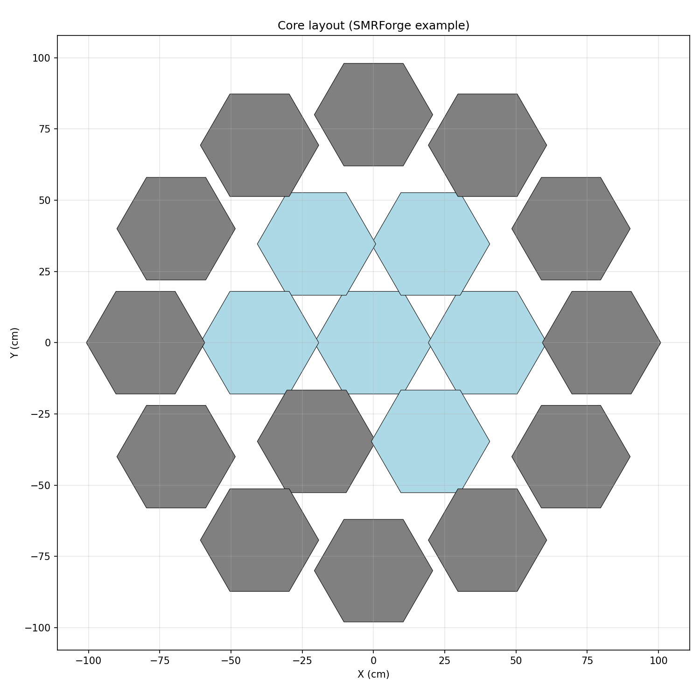
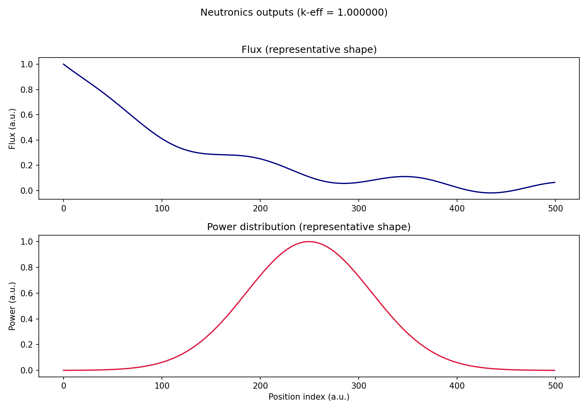
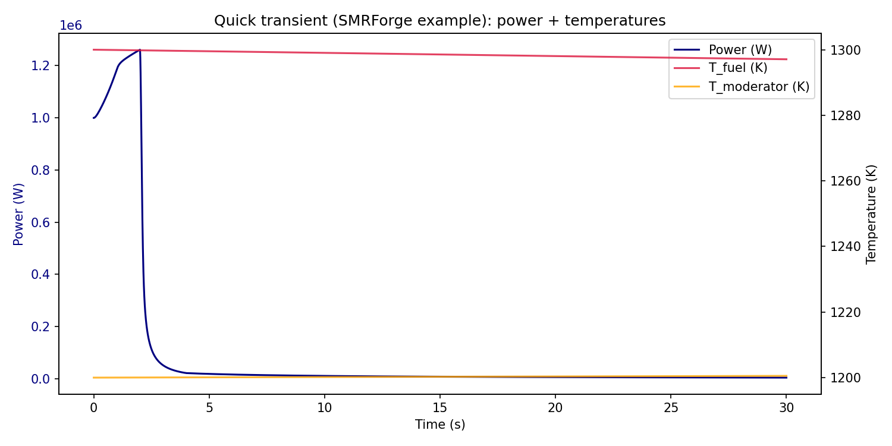

# Visualization gallery

This page shows a few **example visualizations** produced by SMRForge.

These images are generated by `scripts/generate_doc_screenshots.py` and stored in `docs/_static/screenshots/`.

Note: the **core layout** and **transient** plots are generated using SMRForge APIs. The **flux/power** plot is a lightweight representative shape (to keep docs screenshot generation fast and deterministic).

For step-by-step plotting recipes (sweeps, UQ, burnup, transients, economics), see the [Visual analytics cookbook](visual-analytics.md).

## Core layout (2D)



## Neutronics outputs (flux + power)



## Transients (power + temperatures)



## Reproducing locally

```bash
python scripts/generate_doc_screenshots.py
```

